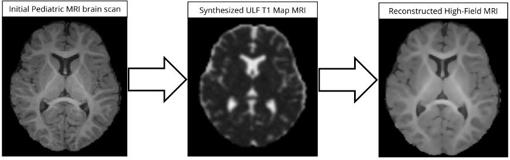
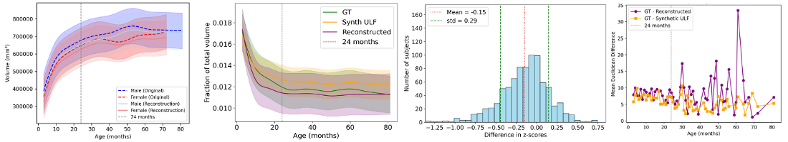

# Pediatric Brain MRI Segmentation from Ultra-Low-Field Scans with Longitudinal Validation

This repository contains the code developed for a method designed to improve segmentation of pediatric brain MRI acquired from ultra-low-field (ULF) scanners. The project focuses on three main aspects:

1. Synthetic ULF image generation

2. Image reconstruction to improve ULF quality

3. Longitudinal validation through neurodevelopmental trajectories

The overall goal is to enable more reliable segmentation of pediatric ULF MRI and to evaluate, in a longitudinal framework, how different processing steps influence developmental metrics.

<p align="center">  </p>

## Pipeline Overview

The workflow starts from a pediatric 3T brain MRI dataset and generates a synthetic 64 mT MRI dataset. This synthetic dataset is then used to train a 3D U-Net reconstruction model that maps ultra-low-field images to higher-field quality. From these reconstructed images, existing automatic segmentation tools (e.g., SynthSeg) are applied to extract brain structures and derive neurodevelopmental metrics.

## Validation Framework

The validation methods consists of 4 differents metrics implemented in the `graphs/` folder:

- Populational metrics:
    - Growth curves: Assess the impact of the method on the overall population growth
trajectories of the four main brain structures.
    - Sub-cortical volume ratios: Evaluate the ability of the method to capture differ- ences in growth rates on smaller structures.
- Subject-specific metrics:
    - Z-score differences: Measure the extent to which the method alters each subject’s deviation from its expected trajectory.
    - Percentile differences: Quantify the change in percentile position resulting from the method for each subject.

<p align="center">  </p>


## Repository Structure

```
├─ unet3D/               
    ├─ model.py                     # 3D U-Net architecture for image reconstruction  
    ├─ data.py                      # Data preparation and loading    
    ├─ prediction.py                # Inference script for reconstruction 

├─ synth_im/               
    ├─ synthesis.py                 # Generation of the synthetic ULF image  
    ├─ synth_dataset.py             # Creation of the synthetic dataset + data augmentation   
    ├─ t1_values.py                 # Extrapolation of T1 values for T1 map generation 

├─ analysis/               
    ├─ build_dict.py                # Creation of the dictionary used in the analysis   
    ├─ compute_dice.py              # Compute Dice scores and save to CSV   
    ├─ compute_zscore.py            # Compute Z-scores and save to CSV

├─ graphs/                 
    ├─ plot_dice.py                 # Dice scores visualization    
    ├─ plot_gam_fit.py              # Growth curves fitted with GAMs     
    ├─ plot_intra_trajectories.py   # Longitudinal dataset distribution   
    ├─ plot_percentile.py           # Euclidean distance between percentiles
    ├─ plot_subcortical_ratios.py   # Subcortical ratios across datasets    
    ├─ plot_zscore.py               # Z-score distribution plots

├─ fig/                             # Figures used in this README.md
└─ README.md                        # Project overview 

```